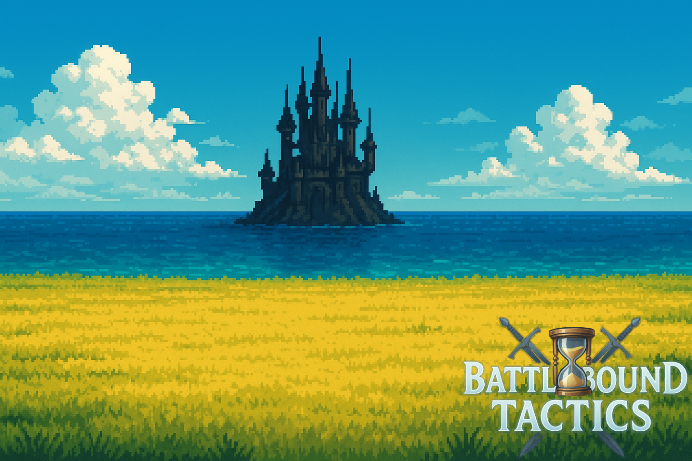

# 🎮 Battlebound Tactics

> *Un RPG por turnos táctico desarrollado como proyecto final del CFGS de DAW por Jonatan García Luna.*

---

## 📌 ¿Qué es Battlebound Tactics?

**Battlebound Tactics** es una aplicación web que simula un juego de rol táctico de combates por turnos, inspirada en
los RPG clásicos pero desarrollada con herramientas modernas como Django, HTML, CSS, JavaScript y Docker.  
En este juego, los jugadores crean su propio personaje, lo desarrollan, equipan habilidades, armas y accesorios únicos,
y se
enfrentan a enemigos con inteligencia artificial en un mapa dividido por regiones.

El objetivo principal es proporcionar una **experiencia estratégica, progresiva y divertida** dentro de un mundo
visualmente atractivo, accesible desde navegador y hecho para el disfrute de todos.

---

## 🧭 ¿Qué puedes encontrar en esta documentación?

Esta documentación técnica está organizada para que desarrolladores, profesores o cualquier persona interesada pueda
comprender el funcionamiento del proyecto a nivel **estructural, técnico y funcional**.

=== "📄 Estructura General"

| Sección                                    | Descripción                                                                           |
|--------------------------------------------|---------------------------------------------------------------------------------------|
| [📦 Modelos del Proyecto](modelos.md)      | Explica cada modelo de Django y sus relaciones.                                       |
| [🖥️ Vistas de Django](vistas.md)          | Explicación detallada de las views, rutas y flujos de usuario.                        |
| [⚔️ Lógica del Combate](logica-combate.md) | Desglose detallado de toda la mecánica de combate: módulos `core/` y vista `combate`. |
| [🧩 API y Ranking](api.md)                 | Detalles del sistema de ranking y uso de endpoints externos.                          |
| [🚀 Despliegue](despliegue.md)             | Cómo levantar el proyecto localmente o en producción con Docker.                      |
| [🧾 Conclusiones](conclusiones.md)         | Reflexiones sobre el desarrollo, dificultades y aprendizajes.                         |

=== "🎮 Módulos del juego, dentro de `core/`"

| Módulo                                            | Descripción                                                                                                      |
|---------------------------------------------------|------------------------------------------------------------------------------------------------------------------|
| [`jugador.py`](core-jugador.md)                   | Controla la lógica del jugador durante el combate: ataques, habilidades, energía, defensa.                       |
| [`enemigos.py`](core-enemigos.md)                 | Implementa la IA enemiga. Decide acciones según el estado del combate, controla habilidades y cooldowns.         |
| [`efectos.py`](core-efectos.md)                   | Sistema de estados: veneno, buffs, debuffs, curaciones. Aplica y gestiona sus duraciones y efectos.              |
| [`estadisticas.py`](core-estadisticas.md)         | Calcula estadísticas finales del jugador/enemigo: ataque, defensa, velocidad, etc. según nivel, pasiva y equipo. |
| [`probabilidades.py`](core-probabilidades.md)     | Define y gestiona las probabilidades de efectos como críticos, evasión, multigolpes, etc.                        |
| [`utils_combate.py`](core-utils-combate.md)       | Funciones auxiliares para interpretar efectos y habilidades. Traduce los textos a efectos aplicables.            |
| [`utils_resolvedor.py`](core-utils-resolvedor.md) | Controla la secuencia de turnos, efectos globales por turno, condiciones de victoria o derrota.                  |

---

## 🛠️ Tecnologías principales utilizadas

- **Backend:** Python + Django (ORM para modelos, vistas lógicas y sesión)
- **Frontend:** HTML + CSS + JavaScript (renderizado de estados, interfaz de combate, navegación)
- **Despliegue:** Docker, Docker Compose, AWS EC2, dominio personalizado
- **Extras:** Pillow (gestión de imágenes), API externa para rankings, Sora AI para generación visual

---

## 🎯 Objetivos del proyecto

- Construir un sistema de combate por turnos con lógica avanzada.
- Desarrollar personajes con progresión, niveles, equipo y habilidades.
- Implementar enemigos con IA reactiva.
- Crear una experiencia de juego completa: mapa, combate, ranking.
- Diseñar una interfaz clara, jugable y atractiva.
- Documentar y desplegar en AWS.

---

## 🏁 Estado actual

✅ Sistema de combate funcional  
✅ Interfaz completa  
✅ Registro de jugadores  
✅ Equipamiento y habilidades  
✅ Ranking de usuarios  
✅ Despliegue funcional con Docker  
❌ PvP, tienda y música (recortado por tiempo / limitaciones de hosting)

---

## 🤝 Autor y créditos

Proyecto realizado por **Jonatan García Luna**, como parte del módulo *Proyecto Integrado* del CFGS en **Desarrollo de
Aplicaciones Web (DAW)** en el I.E.S. Francisco Romero Vargas.

---

> **Nota:** Esta documentación se irá ampliando continuamente. Todas las secciones están estructuradas para facilitar
> tanto la comprensión del código como su mantenimiento o ampliación futura.