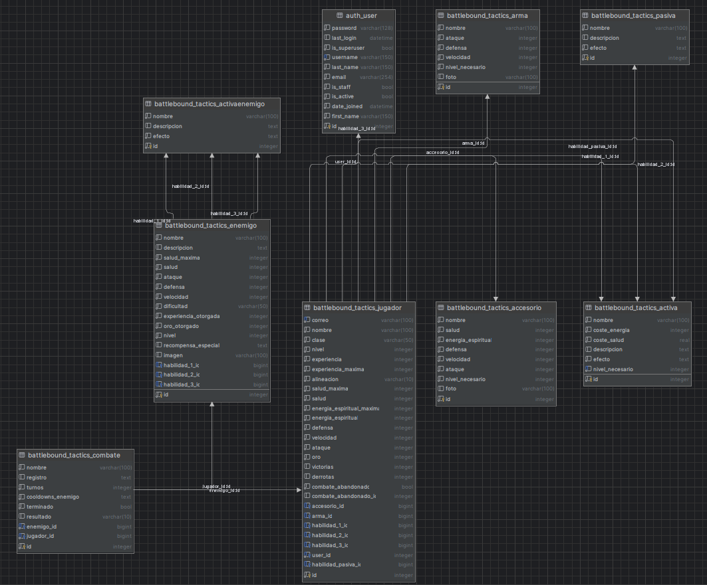

# 🧬 Modelos del Proyecto

Esta sección documenta todos los modelos utilizados en **Battlebound Tactics**, el videojuego web RPG de combate por
turnos. Los modelos están definidos en Django ORM y conforman la base de datos del juego, incluyendo jugadores,
enemigos, habilidades, objetos, combates y más.

---

## 🧍 Jugador (`Jugador`)

Representa al personaje jugable vinculado al usuario.

| Campo                                             | Tipo                 | Descripción                                 |
|---------------------------------------------------|----------------------|---------------------------------------------|
| `user`                                            | OneToOneField → User | Usuario asociado                            |
| `nombre`                                          | CharField            | Nombre del personaje                        |
| `clase`                                           | CharField (choices)  | Clase del personaje (guerrero, mago, etc.)  |
| `alineacion`                                      | CharField (choices)  | Alineación moral del personaje              |
| `nivel`                                           | IntegerField         | Nivel actual                                |
| `experiencia`, `experiencia_maxima`               | IntegerField         | Progreso de experiencia                     |
| `salud`, `salud_maxima`                           | IntegerField         | Puntos de vida actuales y máximos           |
| `energia_espiritual`, `energia_espiritual_maxima` | IntegerField         | Recurso para usar habilidades               |
| `ataque`, `defensa`, `velocidad`                  | IntegerField         | Estadísticas base                           |
| `oro`                                             | IntegerField         | Moneda (puntuación) acumulada               |
| `arma`, `accesorio`                               | ForeignKey           | Equipo en uso                               |
| `habilidad_1/2/3`                                 | ForeignKey → Activa  | Habilidades activas                         |
| `habilidad_pasiva`                                | ForeignKey → Pasiva  | Habilidad pasiva única                      |
| `victorias`, `derrotas`                           | IntegerField         | Registro de combates                        |
| `combate_abandonado`                              | BooleanField         | Flag para combates interrumpidos (sin usar) |
| `combate_abandonado_id`                           | IntegerField         | ID del combate pendiente                    |

---

## ⚔️ Armas y Accesorios

### `Arma`

Armas equipables que afectan al ataque, defensa o velocidad.

| Campo                            | Tipo         | Descripción            |
|----------------------------------|--------------|------------------------|
| `nombre`                         | CharField    | Nombre del arma        |
| `foto`                           | ImageField   | Imagen representativa  |
| `ataque`, `defensa`, `velocidad` | IntegerField | Modificadores          |
| `nivel_necesario`                | IntegerField | Nivel mínimo requerido |

### `Accesorio`

Complementos que mejoran múltiples estadísticas.

| Campo                                                           | Tipo         | Descripción               |
|-----------------------------------------------------------------|--------------|---------------------------|
| `salud`, `energia_espiritual`, `defensa`, `velocidad`, `ataque` | IntegerField | Bonificaciones            |
| `nivel_necesario`                                               | IntegerField | Requisito mínimo de nivel |

---

## ✨ Habilidades

### `Pasiva`

Habilidad única que otorga beneficios permanentes al jugador.

| Campo         | Tipo      | Descripción                        |
|---------------|-----------|------------------------------------|
| `nombre`      | CharField | Identificador                      |
| `descripcion` | TextField | Descripción textual                |
| `efecto`      | JSONField | Define los modificadores aplicados |

### `Activa`

Habilidad que consume energía o salud para aplicar efectos.

| Campo                          | Tipo         | Descripción                            |
|--------------------------------|--------------|----------------------------------------|
| `nombre`                       | CharField    | Nombre visible                         |
| `descripcion`                  | TextField    | Descripción del efecto                 |
| `coste_energia`, `coste_salud` | IntegerField | Coste al usar                          |
| `efecto`                       | JSONField    | JSON con efectos de la habilidad       |
| `nivel_necesario`              | IntegerField | Nivel requerido para usar la habilidad |

### `ActivaEnemigo`

Versión ligera de `Activa` usada por enemigos.

| Campo                   | Tipo                | Descripción                      |
|-------------------------|---------------------|----------------------------------|
| `nombre`, `descripcion` | CharField/TextField | Datos base                       |
| `efecto`                | JSONField           | JSON con efectos de la habilidad |

---

## 😈 Enemigos

### `Enemigo`

Entidad básica de combate.

| Campo                                     | Tipo                       | Descripción             |
|-------------------------------------------|----------------------------|-------------------------|
| `nombre`, `descripcion`, `imagen`         | Texto/Imagen               | Identidad visual        |
| `salud`, `ataque`, `defensa`, `velocidad` | IntegerField               | Estadísticas            |
| `dificultad`, `nivel`                     | IntegerField               | Escalado de combate     |
| `habilidad_1/2/3`                         | ForeignKey → ActivaEnemigo | Técnicas que puede usar |
| `experiencia_otorgada`, `oro_otorgado`    | IntegerField               | Recompensas             |
| `recompensa_especial`                     | JSONField                  | Ítems o condiciones     |

### `Jefe` (Sin uso actualmente)

Extiende `Enemigo` para jefes de alta dificultad.

| Campo           | Tipo         | Descripción                    |
|-----------------|--------------|--------------------------------|
| `habilidades`   | JSONField    | Lista de habilidades dinámicas |
| `es_jefe_final` | BooleanField | Flag para jefe de campaña      |

---

## ⚔️ Combate (`Combate`)

Guarda el estado de una batalla.

| Campo               | Tipo                 | Descripción                 |
|---------------------|----------------------|-----------------------------|
| `nombre`            | CharField            | Título o referencia         |
| `jugador`           | ForeignKey → Jugador | Participante jugador        |
| `enemigo`           | ForeignKey → Enemigo | Enemigo del combate         |
| `registro`          | TextField            | Historial de eventos        |
| `turnos`            | IntegerField         | Número de turnos elapsados  |
| `cooldowns_enemigo` | JSONField            | Seguimiento de habilidades  |
| `terminado`         | BooleanField         | Si el combate ha finalizado |
| `resultado`         | CharField            | Victoria / Derrota          |

---

## 🌍 Mapa y Ubicaciones

### `Ubicacion` (Sin uso actualmente)

Posición en el mapa del mundo.

| Campo               | Tipo                  | Descripción                                 |
|---------------------|-----------------------|---------------------------------------------|
| `nombre`            | CharField             | Nombre de la región o zona                  |
| `coordenadas`       | CharField             | Para su posición en el mapa visual          |
| `tipo`              | CharField (choices)   | Puede ser "combate", "dialogo", "plantilla" |
| `enemigo`           | FK opcional → Enemigo | Si es zona de combate                       |
| `plantilla_destino` | CharField             | Redirección interna                         |
| `texto_dialogo`     | TextField             | Narración mostrada si es tipo diálogo       |

---

## 🧪 Modelos comentados / no activos

También incluye varios modelos desactivados, se usarán en el futuro:

- `Objeto`, `Mochila`, `ObjetoEnMochila`: sistema de inventario (por implementar).
- `Estado`, `EstadoActivo`: control de estados aplicados en combate.
- `HiddenPotential`, `HiddenPotentialNodeTemplate`: posible sistema de mejora tipo "árbol de talentos".

---

## 🧠 Consideraciones técnicas

- El uso de `JSONField` otorga flexibilidad para representar efectos y recompensas.
- Las relaciones `ForeignKey` y `OneToOneField` estructuran perfectamente los datos.
- Se usa `ImageField` para enriquecer visualmente la experiencia en el frontend (Aunque actualmente no hay ninguna imagen añadida, pero la idea es esa).
- La lógica está diseñada para permitir fácil ampliación de funcionalidades futuras.

> ✅ Los modelos sirven como columna vertebral del juego: representan al jugador, sus enemigos, sus batallas, y todo el
> ecosistema de habilidades y objetos.

---

